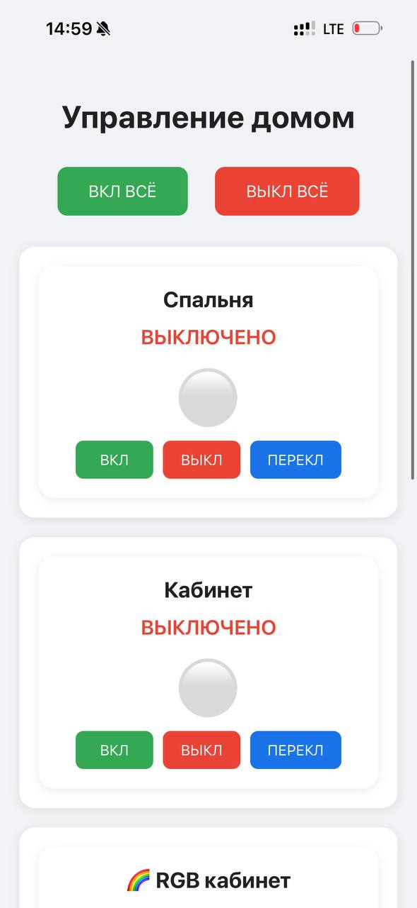

# Smart Home ESP32 Controller

Управление освещением, RGB-лентами и другими устройствами в доме через телефон / голос (WEB-app / Siri / HTTP-API).  
Проект на базе ESP32 + C++ (переход с ArduinoIDE → PlatformIO).

## Возможности
- Управление реле / диммерами по Wi-Fi (переключение света)
- RGB-лента с эффектами (fade, rainbow, etc.)
- Голосовое управление (интеграция с Siri/Iphone shortcuts)
- Мультиплатформенность и оптимизация (мгновеное web-app и http-api - android/ios/pc/mac)

## Аппаратная часть проекта
- ESP32-C3 SuperMini (мозги - на 1 умную штуку нужна одна штука)
- RGB-лента (поправьте в коде тип ленты и кол-во светодиодов) //позже сделаю на экране настройки
- Реле-модули 250VAC/5VDC (для переключения вашего света)
- HLK-PM01 3W Блок питания (для ргб ленты нужен мощнее)
- Резисторы 10кОм (smd)
- Транзисторы BC817
- Клеммы винтовые на 2 и 3 провода

## Стек технологий
- C++17
- PlatformIO + ESP-IDF / Arduino framework
- FastLED / NeoPixel для RGB
- PubSubClient / AsyncMQTT для MQTT
- ESPAsyncWebServer + WebSocket для веб-интерфейса

## Как запустить
1. Установить PlatformIO в VS Code
2. pio run -t upload
3. ESP Раздаёт точку доступа "SmartModule_Setup", подключаемся с любого устройства
4. Переходим с того же устройства по http://192.168.4.1
5. Вводим данные (SSID - Название домашнего Wi-Fi, Пароль - пароль, Master/Slave - об этом ниже)
6. Смотрим на странице роутера ip подключившегося модуля, переходим по http://ваш*ip
7. Готово! Пользуемся умным домом!

## Статус проекта
Рабочий прототип. В процессе рефакторинга и перехода на чистый C++ без Arduino-библиотек.

Лицензия: 
