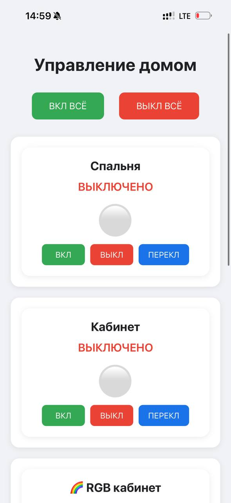
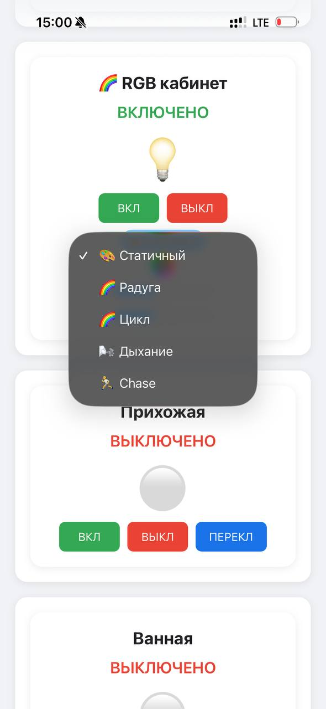
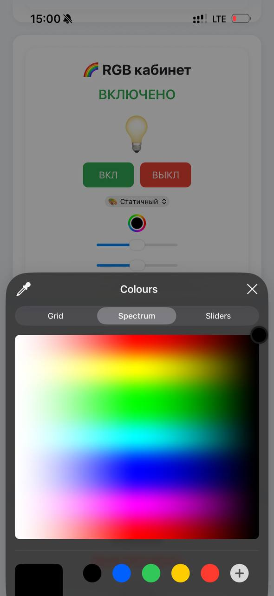

# Smart Home ESP32 Mesh

Не «умная розетка», а собственная mesh-сеть умного дома на ESP32-C3: каждый модуль — реле или RGB-лента — одновременно и узел управления, и часть флота, который обновляется по воздуху одним кликом. Без облака, без чужого сервера, без аккаунта — весь дом работает и управляется внутри вашего же Wi-Fi.

## Зачем городить своё, если розетка из Китая стоит 200₽?

Потому что за эти 200₽ вы покупаете не умный дом, а пульт с батарейкой:

| | Розетка Tuya/Sonoff за ~200₽ | Этот модуль (~1500₽ в сборке) |
|---|---|---|
| Управление | через чужое облако и чужое приложение | напрямую по вашему Wi-Fi, локально |
| Что будет, если производитель закроет сервис | кирпич | будет работать всегда — сервер живёт в самом устройстве |
| Обновление 10 модулей сразу | никак | залил `.bin` один раз на любой узел — раскатилось на весь дом само |
| Если сгорит нода | покупаешь новую розетку заново | перепаиваешь один узел, вся сеть переживает это без единого сбоя у остальных |
| Что видно с одного экрана | одна комната в приложении | весь дом, с любого узла — откройте страницу хоть с лампы в прихожей, хоть с ленты на кухне |
| Приватность | данные уходят на сервера производителя | ничего никуда не уходит за пределы роутера |

Разница в цене — это разница между «пультом» и «системой». За 1500₽ вы получаете не реле с Wi-Fi-чипом, а полноценный узел mesh-сети со своим веб-сервером, watchdog'ом, автопереподключением и OTA-клиентом на борту.

## Что реально умеет

- **Дашборд с любого узла.** Не нужен отдельный «главный» экран — откройте `http://<ip>` любого модуля и получите панель со всем домом: имя, статус, живой индикатор каждой комнаты. Нажатие на плашку = переключение, без лишних кнопок.
- **Обновление всей сети по воздуху за один клик.** Заливаете `.bin` один раз на любой узел с ролью master, жмёте «Обновить всю сеть» — он сам находит все известные модули, раздаёт им прошивку по очереди и ждёт подтверждения перед тем, как перейти к следующему. Ни одного USB-кабеля после первой прошивки.
- **Автообнаружение без настройки.** Модули объявляют себя в сети по UDP и сами строят карту всего дома — добавили новый модуль, он через пару секунд уже виден отовсюду.
- **RGB WS2812 из коробки.** Статичный цвет, радуга, цикл, дыхание, chase — с ограничением яркости на уровне прошивки (85% от максимума), чтобы диоды не выгорали от жадности пользователя к яркости.
- **Прошивка подстраивается под ваше железо, а не наоборот.** Реле на другой ревизии платы включается высоким уровнем вместо низкого? Лента распаяна на другой GPIO? Меняется в `/config` без перекомпиляции и перепрошивки.
- **Само себя лечит.** Аппаратный watchdog перезапускает модуль, если прошивка зависла; при потере Wi-Fi — сам переподключается, а если не помогло — перезагружается. Реле, которое «отвалилось» на неделю в отпуске, само придёт в себя.
- **Двойной OTA-раздел + partition для дампа краша.** Обновление пишется во второй, неактивный раздел прошивки — сбой при заливке не убьёт рабочую версию. Упал — есть куда посмотреть coredump.
- **Ноль зависимости от интернета.** Работает по локальному Wi-Fi. Упал провайдер — дом всё равно включается и выключается как обычно.

## Скриншоты

> Скрины — с предыдущей версии интерфейса (там ещё отдельные кнопки ВКЛ/ВЫКЛ/ПЕРЕКЛ). В текущей версии вся плашка — это одна большая кнопка-переключатель, а режимы/цвет/яркость RGB работают точно так же, как на скриншотах.

## «Siri, включи свет» — без единой строчки кода

Голосовое управление в прошивку не зашито, MQTT/HomeKit не реализованы — но это и не нужно, потому что каждая команда уже и так одна простая HTTP-ссылка. На iPhone это подключается через приложение **Команды** (Shortcuts), без сторонних сервисов и без единой строчки кода:

1. Открыть **Команды** → вкладка «Автоматизация» или «Команды» → **+** (новая команда).
2. Добавить действие **«Содержимое URL»** (Get Contents of URL).
3. В поле URL вставить адрес нужного модуля, например `http://192.168.10.34/toggle` (можно `/on` и `/off`, если нужны раздельные команды «включи» и «выключи», а не переключатель).
4. Нажать на название команды сверху, переименовать по-человечески — например «Свет в спальне» — это и есть фраза, которую поймёт Siri.
5. Готово: «Эй Siri, свет в спальне» — и реле щёлкает. Для ленты так же дергаются `/mode?set=`, `/color?hex=`, `/brightness?val=` — можно сделать отдельную команду хоть на каждый режим.

Важно: телефон должен быть в той же Wi-Fi-сети, что и модули (это локальный LAN-запрос, наружу в интернет он не ходит и наружу пускать это не стоит). Если на сети задан общий OTA/admin-ключ — он тут ни при чём, он нужен только для `/config` и `/fleet/*`, обычные `/on`, `/off`, `/toggle` открыты для всех в локальной сети.

## Аппаратная часть

- ESP32-C3 (проект настроен под Adafruit QT Py ESP32-C3 / esp32-c3-m1i-kit, 4MB флеша — критично для двух полноразмерных OTA-разделов, см. `partitions.csv`)
- Реле-модуль 250VAC для модулей типа «реле» (пин настраивается в `/config`, поддерживает инвертированную полярность)
- Лента WS2812/NeoPixel для модулей типа «RGB» (пин данных тоже настраивается в `/config`)

## Как запустить

1. Установить PlatformIO (расширение VS Code) или `pio` из командной строки.
2. `pio run -t upload` — прошить модуль по USB (один раз на физический модуль; дальше всё обновляется по Wi-Fi).
3. Модуль поднимает точку доступа `SmartModule_Setup` — подключаетесь к ней.
4. Открываете `http://192.168.4.1`, вводите Wi-Fi (**обязательно 2.4 ГГц**), имя комнаты, тип модуля (реле/RGB) и роль (`master` — один на дом, `slave` — все остальные).
5. Смотрите на роутере, какой IP получил модуль, открываете `http://<ip>` — увидите панель всего дома.
6. Переименовать модуль, сменить роль или тип, поправить полярность реле/пин ленты — без точки доступа, прямо через `http://<ip>/config`.

## Обновление прошивки по сети

1. Собрать прошивку (`pio run`), поднять `FIRMWARE_VERSION` в `src/globals.h` — так на `/status` любого модуля видно, что на нём стоит.
2. Зайти на любой узел, внизу страницы открыть «Настройки, прошивка», загрузить `.bin`.
3. Нажать «Обновить всю сеть» — раскатится по всем известным модулям с прогрессом по каждому.

Модуль на самой первой (неOTA) прошивке нужно один раз обновить по USB — дальше он тоже подключится к общему обновлению.

Если задан общий OTA-ключ, он должен быть одинаковым на всех модулях сети.

## Разработка проекта дальше

Архитектура, порядок инициализации, известные подводные камни и как добавить новый тип модуля — в [docs/DEVELOPMENT.md](docs/DEVELOPMENT.md).

## Статус проекта

Рабочая система, обкатанная на реальной домашней сети из нескольких модулей разных типов.

Лицензия: [MIT](LICENSE.txt)
